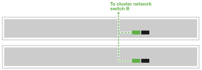

= Verkabeln Sie Ihre Drittanbieterserver für AI Data Engine
:allow-uri-read: 
:icons: font
:imagesdir: ../media/

[role="lead"]
Verbinden Sie Ihre Drittanbieterserver mit den Host-Netzwerk- und Cluster-Netzwerk-Switches, um die Verarbeitung von KI-Workloads und die Integration mit Ihrem AFX 1K-Speichersystem zu ermöglichen. Dieses Verfahren nutzt Verbindungen sowohl für den Netzwerkzugriff als auch für die Clusterkommunikation, sodass die Knoten die bestehende Clusterinfrastruktur nutzen können, ohne das AFX-System herunterzufahren.

.Über diese Aufgabe
Diese Vorgehensweisen zeigen gängige Konfigurationen. Die genaue Verkabelung hängt von den mit Ihrem Speichersystem kompatiblen Komponenten ab. Ausführliche Konfigurationsdetails finden Sie in der Dokumentation Ihres Serverherstellers.

.Bevor Sie beginnen
* Sie haben bereits ein AFX 1K-Speichersystem installiert. Informationen zur Installation des AFX 1K-Speichersystems finden Sie unter link:https://docs.netapp.com/us-en/ontap-afx/install-setup/install-setup-workflow.html["AFX 1K Speichersystem-Installationsdokumentation"^].
* Die erforderlichen Netzwerk-Switches sind installiert und konfiguriert. Wenden Sie sich an Ihren Netzwerkadministrator, um Informationen zum Anschluss des Systems an Ihre Netzwerk-Switches zu erhalten.
* Sie haben die Verkabelungsanforderungen für Ihre Drittanbieterserver geprüft. Informationen zur Verkabelungskonfiguration finden Sie in der Dokumentation Ihrer Drittanbieterserver.

NOTE: Für die Bereitstellung der AI Data Engine software werden drei Server von Drittanbietern benötigt.

== Schritt 1: Verbinden Sie die Server von Drittanbietern mit dem Hostnetzwerk

Für Server von Drittanbietern stellen Sie eine Verbindung zu Ihrem Host-Netzwerk her.

.Schritte
. Verbinden Sie die 'b' 100GbE-Netzwerkanschlüsse der Drittanbieterserver mit dem Ethernet Netzwerk-Switch A, indem Sie die entsprechenden Kabel verwenden, die auf den Netzwerkschnittstellenkarten (NICs) Ihrer Server und den Switch-Porttypen basieren.
+
Beispiel:

+
** Drittanbieter-Server 1, Port 'e4b'
** Drittanbieter-Server 2, Port 'e4b'
+
*100GbE-Kabel*

+
image::../media/oie_cable100_gbe_qsfp28.png[100-Gb-Ethernet-Kabel]

+
image::../media/drw_aide_server_host_a_ieops-2831.svg[Kabel zu Ethernet-Netzwerk]

. Verbinden Sie die 100GbE-Netzwerkanschlüsse „b“ der Server von Drittanbietern mit dem Ethernet Netzwerk-Switch B, indem Sie die entsprechenden Kabel verwenden, die auf den Netzwerkschnittstellenkarten (NICs) Ihrer Server und den Porttypen des Switches basieren. Zum Beispiel:
+
** Drittanbieter-Server 1, Port 'e5b'
** Drittanbieter-Server 2, Port 'e5b'
+
*100GbE-Kabel*

+
image::../media/oie_cable100_gbe_qsfp28.png[100-Gb-Ethernet-Kabel]

+
image::../media/drw_aide_server_host_b_ieops-2832.svg[Kabel zu Ethernet-Netzwerk]

NOTE: Spezifische Portkonfigurationen und Kabeltypen entnehmen Sie bitte der Dokumentation Ihres Drittanbieter-Servers.

== Schritt 2: Die Clusterverbindungen verkabeln

Bei Servern von Drittanbietern müssen die Clusterverbindungen verkabelt werden.

.Schritte
. Verbinden Sie die 'a' 100GbE Cluster-Netzwerkports auf den Servern des Drittanbieters mit dem Cluster-Netzwerk-Switch A, indem Sie die entsprechenden Kabel verwenden, die auf den Netzwerkschnittstellenkarten (NICs) und den Switch-Port-Typen Ihrer Server des Drittanbieters basieren.
+
Beispiel:

+
** Drittanbieter-Server 1, Port 'e4a'
** Drittanbieter-Server 2, Port 'e4a'
+
*100GbE-Kabel*

+
image::../media/oie_cable100_gbe_qsfp28.png[100-Gb-Ethernet-Kabel]

+
image::../media/drw_aide_server_cluster_a_ieops-2833.svg[Kabel zu Ethernet-Netzwerk]

. Verbinden Sie die 'a' 100GbE Cluster-Netzwerkports auf den Servern des Drittanbieters mit dem Cluster Netzwerk-Switch B, indem Sie die entsprechenden Kabel verwenden, die auf den Netzwerkschnittstellenkarten (NICs) Ihrer Server und den Switch-Port-Typen basieren.
+
Beispiel:

+
** Drittanbieter-Server 1, Port 'e5a'
** Drittanbieter-Server 2, Port 'e5a'
+
*100GbE-Kabel*

+
image::../media/oie_cable100_gbe_qsfp28.png[100-Gb-Ethernet-Kabel]

+

NOTE: Spezifische Portkonfigurationen und Kabeltypen entnehmen Sie bitte der Dokumentation Ihres Drittanbieter-Servers.

.Was kommt als Nächstes?
Nachdem Sie die Hardware verkabelt haben, link:power-on-hardware.html["Schalten Sie Ihre Drittanbieterserver ein"].
