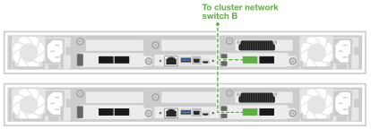

= Verkabeln Sie Ihre Data Compute Node für AI Data Engine
:allow-uri-read: 
:icons: font
:imagesdir: ../media/

[role="lead"]
Verbinden Sie Ihre Datenrechenknoten mit den Host-Netzwerk- und Cluster-Netzwerk-Switches, um die Verarbeitung von KI-Workloads und die Integration mit Ihrem AFX 1K-Speichersystem zu ermöglichen. Dieses Verfahren nutzt Verbindungen sowohl für den Netzwerkzugriff als auch für die Clusterkommunikation, sodass die Knoten die bestehende Clusterinfrastruktur nutzen können, ohne das AFX-System herunterzufahren.

.Über diese Aufgabe
Diese Verfahren zeigen gängige Konfigurationen. Die spezifische Verkabelung hängt von den für Ihr Speichersystem bestellten Komponenten ab.

NOTE: Das AFX 1K-Speichersystem muss beim Verkabeln der NetApp Datenrechenknoten nicht ausgeschaltet werden. Sie können die Datenrechenknoten zu einem bereits eingeschalteten und konfigurierten AFX 1K-Speichersystem hinzufügen. Spezifische Verkabelungsanweisungen für Server von Drittanbietern finden Sie in der Installationsdokumentation Ihres Servermodells.

.Bevor Sie beginnen
* Sie haben bereits ein AFX 1K-Speichersystem installiert. Informationen zur Installation des AFX 1K-Speichersystems finden Sie unter link:https://docs.netapp.com/us-en/ontap-afx/install-setup/install-setup-workflow.html["AFX 1K Speichersystem-Installationsdokumentation"^].
* Die erforderlichen Netzwerk-Switches sind installiert und konfiguriert. Wenden Sie sich an Ihren Netzwerkadministrator, um Informationen zum Anschluss des Systems an Ihre Netzwerk-Switches zu erhalten.
* Sie haben die Verkabelungsanforderungen für Ihre Server von Drittanbietern oder von NetApp bereitgestellte Datenrechenknoten überprüft. Informationen zur Verkabelungskonfiguration finden Sie unter link:cable-overview.html["Verkabelungsanforderungen für die Data Compute Node"].

NOTE: Drei von NetApp bereitgestellte Data-Compute-Knoten sind erforderlich, um AI Data Engine bereitzustellen.

== Schritt 1: Verbinden Sie die Data Compute Nodes mit dem Hostnetzwerk

Für von NetApp bereitgestellte Datenrechenknoten können Sie die Ports der Datenrechenknoten mit Ihrem Host-Netzwerk verbinden.

.Schritte
. Verbinden Sie Port e4b der folgenden Data Compute Nodes mit dem Ethernet-Datennetzwerk Netzwerk-Switch A:
+
** Data Compute Node 1, Port e4b
** Data Compute Node 2, Port e4b
+
*100GbE-Kabel*

+
image::../media/oie_cable100_gbe_qsfp28.png[100-Gb-Ethernet-Kabel]

+
image::../media/drw_aide_network_cabling_a_ieops_2647.svg[Kabel zu Ethernet-Netzwerk]

. Verbinden Sie Port e5b der folgenden Data Compute Nodes mit dem Ethernet-Datennetzwerk-Switch B:
+
** Data Compute Node 1, Port e5b
** Data Compute Node 2, Port e5b
+
*100GbE-Kabel*

+
image::../media/oie_cable100_gbe_qsfp28.png[100-Gb-Ethernet-Kabel]

+
image::../media/drw_aide_network_cabling_b_ieops-2648.svg[Kabel zu Ethernet-Netzwerk]

== Schritt 2: Die Clusterverbindungen verkabeln

Für von NetApp bereitgestellte Datenrechenknoten verwenden Sie 4x100GbE-Breakout-Kabel, um die e4a/e5a-Ports für die Clusterverbindungen zu verbinden.

.Schritte
. Verbinden Sie Port e4a der folgenden Data Compute Node mit einem Nicht-ISL-Port am Cluster Netzwerk-Switch A:
+
** Data Compute Node 1, Port e4a
** Data Compute Node 2, Port e4a
+
*4x100GbE Breakout-Kabel*

+
image::../media/oie_cable100_gbe_qsfp28.png[100-Gb-Ethernet-Kabel]

+
image::../media/drw_aide_switched_cluster_cabling_a_ieops-2649.svg[Kabel zu Ethernet-Netzwerk]

. Verbinden Sie Port e5a der folgenden Data Compute Node mit einem Nicht-ISL-Port am Cluster Netzwerk-Switch B:
+
** Data Compute Node 1, Port e5a
** Data Compute Node 2, Port e5a
+
*4x100GbE Breakout-Kabel*

+
image::../media/oie_cable100_gbe_qsfp28.png[100-Gb-Ethernet-Kabel]

+

.Was kommt als Nächstes?
Nachdem Sie die Hardware verkabelt haben, link:power-on-hardware.html["Schalten Sie Ihre Data Compute Node ein"].
