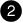

= Anforderungen an die Verkabelung von Data Compute Node für AI Data Engine
:allow-uri-read: 
:icons: font
:imagesdir: ../media/

[role="lead"]
Data Compute Nodes werden über Host-Netzwerk- und Cluster-Netzwerkverbindungen in Ihr AFX 1K Storage System integriert. Überprüfen Sie die I/O-Steckplatzkonfiguration, die Kabeltypen und die Verbindungsanforderungen für Ihre Bereitstellung.

NetApp-bereitgestellte Datenrechenknoten werden an dieselben Cluster-Switches wie die AFX 1K Controller-Knoten angeschlossen und erweitern so Ihr Speichersystem um Rechenressourcen, die für KI- und Machine-Learning-Workloads optimiert sind.

Die anfängliche AI Data Engine (AIDE) Konfiguration unterstützt mindestens drei Data Compute Nodes.

image::../media/drw_aide-dcn_back_slots_labeled_ieops-2646.svg[Slotnummerierung auf einem Data Compute Node]

[cols="1,4"]
|===

 a| 
image::../media/icon_round_1.png[Legende Nummer 1]
 a| 
Unbenutzter Steckplatz auf dem Data Compute Node.

 a| 

 a| 
Unbenutzter Steckplatz auf dem Data Compute Node.

 a| 
image::../media/icon_round_3.png[Callout-Nummer 3]
 a| 
GPU-Steckplatz auf dem Data Compute Node.

 a| 
image::../media/icon_round_4.png[Callout-Nummer 4]
 a| 
E/A-Steckplatz am Data Compute Node.

 a| 
image::../media/icon_round_5.png[Callout-Nummer 5]
 a| 
E/A-Steckplatz am Data Compute Node.

|===

== NetApp-bereitgestellte Data Compute-Node-I/O-Slot-Konfiguration

Der Data Compute Node verwendet ein spezielles Steckplatznummerierungsschema, das sich von Standardserverkonfigurationen unterscheidet. Das Verständnis des Steckplatzlayouts ist für die korrekte Verkabelung unerlässlich.

* *Steckplatz 3*: Für GPU reserviert (nicht zugänglich für I/O-Kabel)
* *Steckplätze 4 und 5*: E/A-Steckplätze, die für Netzwerkverbindungen verwendet werden
+
** Port a: Cluster-Netzwerkverbindungen
** Port b: Host-Netzwerkverbindungen

* *Slots 1 und 2*: Nicht belegt und nicht zugänglich für die Nutzung

== NetApp-bereitgestellte Daten-Compute-Node-Netzwerkverbindungen

Data Compute Nodes benötigen zwei Arten von Netzwerkverbindungen, um mit dem AFX 1K-Speichersystem integriert zu werden.

* *Host-Netzwerkverbindungen*
+
Host-Netzwerkverbindungen bieten Zugriff auf Clientdaten und ermöglichen es den Data Compute Nodes, Workloads zu verarbeiten. Jeder Data Compute Node verwendet die Ports e4b und e5b für redundante Verbindungen zu separaten Netzwerk-Switches.

+
Hafenzuweisungen:

+
** e4b: Verbindet sich mit dem Netzwerk-Switch A
** e5b: Verbindet sich mit dem Host Netzwerk-Switch B

* *Cluster-Netzwerkverbindungen*
+
Cluster-Netzwerkverbindungen ermöglichen die Kommunikation zwischen Data Compute Nodes und AFX 1K Controller Nodes innerhalb des Storage Clusters. Jeder Data Compute Node verwendet die Ports e4a und e5a für redundante Verbindungen zu separaten Cluster-Netzwerk-Switches.

+
Hafenzuweisungen:

+
** e4a: Verbindet sich mit dem Netzwerk-Switch A des Clusters
** e5a: Verbindet sich mit dem Cluster Netzwerk-Switch B

== Unterstützte Hardwarekomponenten

NetApp-bereitgestellte Datenrechenknoten benötigen spezielle Kabel und Switches, um eine ordnungsgemäße Konnektivität und Leistung mit dem AFX 1K-Speichersystem sicherzustellen.

[cols="2,3,6"]
|===
| *Rechenknoten* | *Unterstützte Switches* | *Unterstützte Kabel* 

 a| 
NetApp-bereitgestellte Datenrechenknoten (mindestens drei erforderlich)
 a| 
* Cisco Nexus 9332D-GX2B (400GbE)
* Cisco Nexus 9364D-GX2A (400GbE)

 a| 
* 400GbE QSFP-DD Breakout auf 4x100GbE QSFP56-Kabel für Verbindungen zu Data Compute Nodes:
+
** 100GbE zu den Data Compute Node-Cluster-Netzwerkports (e4a, e5a)
** 100GbE zu den Host-Netzwerkports des Data Compute Node (e4b, e5b)

* RJ-45-Kabel für Managementverbindungen

NOTE: Breakout-Kabel stellen vier 100-GbE-Verbindungen von jedem 400-GbE-Switch-Port bereit. Verbinden Sie das 400-GbE-Ende mit den Switches und das 100-GbE-Ende mit den Data Compute Node I/O-Ports.

|===

== Kabelausrichtung

Bei der Verbindung von Kabeln mit Rechenknoten gewährleistet die richtige Kabelausrichtung zuverlässige Verbindungen.

Die Verkabelungsgrafiken in den Installationsanweisungen zeigen Pfeilsymbole, die die korrekte Ausrichtung (oben oder unten) der Zuglasche des Kabelsteckers beim Einführen eines Steckers in einen Port anzeigen. Beim Einführen des Steckers sollten Sie spüren, wie er einrastet. Wenn Sie kein Einrasten spüren, entfernen Sie ihn, drehen Sie ihn um und versuchen Sie es erneut.

image:../media/drw_cable_pull_tab_direction_ieops-1699.svg["Richtung der Kabelzuglasche"]

CAUTION: Behandeln Sie die empfindlichen Steckverbinderkomponenten vorsichtig, wenn Sie sie einrasten lassen.

.Was kommt als Nächstes?
Nach Überprüfung der Kabelkonfiguration, link:cable-hardware.html["Verkabeln Sie die Hardware für Ihre Datenrechenknoten"].
